# Overview: System-At-A-Glance Topology

This file is the system-at-a-glance topology reference for GroundX. The diagram below plus the 60-second walkthrough is what most readers need before they descend into a specific topic file. For the canonical 1-paragraph framing at each altitude, see `altitudes.md`.

> **Rendering note.** The Mermaid diagram below renders natively in GitHub, most IDEs with Markdown Preview Mermaid Support, and standard rendering pipelines. VS Code's default Markdown preview does not include Mermaid — install the *Markdown Preview Mermaid Support* extension, or view this file on GitHub.

## 1. The diagram

```mermaid
flowchart TB
    %% External API clients — all hit groundx (the single ingress for customer + partner APIs)
    subgraph ExtClients["External API clients (all go through the groundx pod)"]
        direction TB
        SDKs["groundx-python · groundx-typescript SDKs<br/>generated via Fern from openapi.yml"]
        Harness["Agent Harness<br/>skills · scaffolds · widgets · workflow infra"]
        Frontends3["Company frontends (customer + partner API):<br/>EyeLevel SSP · GroundX Dashboard · FraudX"]
        CustomFE["Customer-built frontends (customer API only;<br/>one customer account per customer)"]
    end

    LLM3P>"3rd-party LLM<br/>OpenAI / Azure / DeepInfra<br/>when summary.serviceType is set"]

    subgraph K8s["Kubernetes Cluster — values.yaml selects backing services and deployment target (AWS · Azure · Red Hat OpenShift · generic on-prem · minikube · air-gapped)"]
        APIH["<b>groundx</b><br/>API Handler"]
        Upload["<b>upload</b><br/>File Uploader"]
        Queue["<b>queue</b><br/>Start Process"]
        Pre["<b>pre-process</b><br/>Processor"]
        Proc["<b>process</b><br/>Save Results"]
        Metrics["<b>metrics</b><br/>HPA + Prometheus/Grafana"]

        subgraph LayoutPipe["Layout pipeline (Celery-orchestrated)"]
            LayAPI["<b>layout-api</b>"]
            LaySteps["layout-process → layout-correct →<br/>[layout-inference (GPU) + layout-ocr concurrent] →<br/>layout-map → layout-save"]
            LayHook["<b>layoutWebhook</b>"]
        end

        subgraph SumGroup["Metadata Generation"]
            SumClient["<b>summary-client</b><br/>API client"]
            SumStack["<b>summary-api</b> + <b>summary-inference</b> (GPU)<br/>self-hosted; only when summary.create=true"]
        end

        subgraph ExtractGroup["Extract microservice — OPT-IN (values.yaml + per-workflow extraction YAML)"]
            ExtAPI["<b>extract-api</b>"]
            ExtSteps["extract-download →<br/>parallel agents (reconcile + QA, per category) →<br/>extract-save → ... (schema-driven)"]
        end

        subgraph RankGroup["Ranker (re-ranking)"]
            RankAPI["<b>ranker-api</b>"]
            RankInf["<b>ranker-inference</b> (GPU)"]
        end

        subgraph WSGroup["Workspace runner — separate agent-facing API (not part of ingest pipeline)"]
            WSAPI["<b>workspace-api</b>"]
            WSPods["workspace · provision ·<br/>command · publish · cleanup"]
        end

        DB[("Process Metadata<br/>MySQL/RDS + Redis")]
        OS[("Retrieval DB<br/>OpenSearch")]
        FS[("File Storage<br/>MinIO/S3")]
    end

    ExtClients -->|"REST / SDK"| APIH

    %% Ingest — two entry paths
    APIH -->|"Queue (URL files)"| Upload
    APIH -->|"Queue (binary files)"| Queue
    Upload -->|"writes file"| FS
    Upload -->|"writes metadata"| DB
    Upload -->|"Queue"| Queue
    Queue -->|"Queue"| Pre

    %% Layout branch (writes intermediate artifacts)
    Pre -->|"API"| LayAPI
    LayAPI --> LaySteps
    LaySteps -.->|"intermediate artifacts"| FS
    LaySteps -->|"API callback"| LayHook
    LayHook -->|"Queue"| Pre
    Pre -.->|"intermediate artifacts"| FS

    %% Summary branch (skipped when processLevel = None)
    Pre -->|"Queue (when processLevel != None)"| SumClient
    SumClient -->|"API (self-hosted)"| SumStack
    SumClient -.->|"API (3rd party)"| LLM3P
    SumClient -.->|"intermediate artifacts"| FS
    SumClient -->|"Queue callback"| Pre

    %% Extraction branch (opt-in, dashed)
    Pre -.->|"API (when extraction enabled)"| ExtAPI
    ExtAPI -.-> ExtSteps
    ExtSteps -.->|"API callback"| LayHook

    %% Process (terminal)
    Pre -->|"Queue"| Proc
    Proc -->|"writes"| OS
    Proc -->|"writes"| DB
    Proc -->|"writes"| FS

    %% Search path
    APIH <-->|"keyword + vector"| OS
    APIH <-->|"auth + status"| DB
    APIH -->|"API"| RankAPI
    RankAPI <--> RankInf

    %% Workspace runner - Workspace facade routed through groundx (NOT part of ingest pipeline)
    APIH -.->|"API (Workspace facade routing)"| WSAPI
    WSAPI -.-> WSPods

    %% Observability
    Metrics -.->|"scrape all pods"| APIH

    classDef gpu fill:#fde,stroke:#c00,stroke-width:2px;
    classDef cpu fill:#def,stroke:#06c;
    classDef store fill:#ffd,stroke:#a80;
    classDef external fill:#f5f5f5,stroke:#666;

    class SumStack,RankInf gpu;
    class APIH,Upload,Queue,Pre,Proc,LayAPI,LayHook,SumClient,RankAPI,Metrics,WSAPI cpu;
    class DB,OS,FS store;
    class LLM3P external;
```

**Reading the diagram (arrow vocabulary):**

- **External clients** (top of the diagram): SDKs (`groundx-python`, `groundx-typescript`, both Fern-generated from `openapi.yml`), the **Agent Harness** (skills / scaffolds / widgets / workflow infra — the major adoption surface above GroundX), three company-owned frontends (EyeLevel SSP, GroundX Dashboard, FraudX — customer + partner API access), and dozens of customer-built frontends (customer API only). All external clients converge on the **`groundx`** pod — it's the single ingress for both customer-tier and partner-tier APIs.
- **Solid arrows** are default paths every deployment runs.
- **Dashed arrows** are opt-in / conditional / intermediate — the Extract microservice (`values.yaml` + per-workflow YAML), the 3rd-party LLM (when `summary.serviceType` is set), the workspace runner (Workspace facade routing through `groundx`, not part of ingest), intermediate-artifact writes to File Storage during layout / summary / pre-process steps, and the metrics scrape.
- Each edge is labeled with its **communication mechanism**: `Queue` (Celery queue between major pipeline pods), `API` (HTTP call), `Celery` (intra-subsystem task chain — shown inside subgraphs), `API callback` (HTTP callback).
- **GPU pods** are red-tinted: `layout-inference` (inside the layout subgraph — the fine-tuned vision model), `summary-inference` (inside the self-hosted summary stack), `ranker-inference` (inside the ranker pair). These three are the dominant cost driver.
- **Backing-service alternatives** (Kafka or SQS; MinIO or S3; MySQL or RDS) are listed inside the data-store nodes. `values.yaml` selects which backing service each component talks to per deployment.
- **All pods are stateless** — every pod can be replicated freely. State lives in the shared data-store tier. This is what makes the metrics-driven HPA and the per-page layout concurrency work cleanly.

## 2. Communication matrix

The arrow labels in the diagram are intentionally specific. This matrix is the canonical source for what mechanism each inter-pod connection uses:

| From | To | Mechanism | Notes |
| --- | --- | --- | --- |
| External clients (SDKs, Agent Harness, frontends) | `groundx` | API (REST) | `groundx` is the single ingress for both customer-tier and partner-tier APIs |
| `groundx` | `workspace-api` | API (Workspace facade routing) | Workspace operations route here from `groundx`; NOT from `pre-process` |
| `groundx` | `upload` | Queue | URL-shared files only |
| `groundx` | `queue` | Queue | Binary-data files routed directly here (not through `upload`) |
| `upload` | `queue` | Queue | — |
| `queue` | `pre-process` | Queue | — |
| `pre-process` | `layout-api` | API | — |
| `pre-process` | `summary-client` | Queue | When `processLevel != None`; skipped entirely when `processLevel = None` |
| `pre-process` | `extract-api` | API | When extraction is enabled |
| `pre-process` | `process` | Queue | Terminal step |
| `pre-process` | File Storage | Writes | Intermediate artifacts during orchestration |
| `layout-api` | layout sub-pods | Celery tasks | Intra-pipeline orchestration |
| layout (final) | `layoutWebhook` | API callback | — |
| `layoutWebhook` | `pre-process` | Queue | — |
| `summary-client` | `summary-api` | API-like | Shape-identical to a 3rd-party LLM call |
| `summary-client` | 3rd-party LLM | API | When `summary.serviceType` is `openai` / `openai-base64` / `azure` / `deep-infra` |
| `summary-client` | `pre-process` | Queue | Callback after summary completes |
| `summary-api` | `summary-inference` | Celery tasks | — |
| `extract-api` | extract sub-pods | Celery tasks | Intra-pipeline orchestration |
| extract (final) | `layoutWebhook` | API callback | NOT back to `groundx` — calls `layoutWebhook` which then enqueues to `pre-process` |
| layout sub-pods | File Storage | Writes | Intermediate artifacts (page images, OCR text, detection results, mapped layouts) |
| `summary-client` | File Storage | Writes | Summary intermediate artifacts |
| `workspace-api` | workspace sub-pods | Celery tasks | — |
| `groundx` | OpenSearch | Direct query | Search path; `groundx` does keyword + vector search itself |
| `groundx` | `ranker-api` | API | Search path |
| `metrics` | all pods | Scrape | Prometheus-compatible; drives HPA |

## 3. Sixty-second walkthrough

**External API surface.** All external clients hit the **`groundx`** pod, which is the single ingress for both customer-tier and partner-tier APIs. The external clients are: (1) the **`groundx-python`** and **`groundx-typescript`** SDKs, both generated by Fern from `openapi.yml` (the same spec also produces the public docs site); (2) the **Agent Harness** — the agent-facing development surface above GroundX (skills / scaffolds / widgets / workflow infra); (3) three company-owned frontends with customer + partner API access (see below), none built with the Harness; (4) **dozens of customer-built frontends**, all ad-hoc per-customer builds — none built with the Harness yet. The Harness is the **aspirational** default for new customer and internal frontends going forward (target: hours-to-days build time instead of the weeks-to-months ad-hoc builds have historically taken). The Python SDK adds a hand-maintained `extract` submodule, high-level extraction workflow helpers, `ingest`, and `ingest_directories` on top of the Fern-generated baseline. The TypeScript SDK is the pure Fern-generated version.

**The three company frontends — each architecturally distinct.** **EyeLevel SSP** is the oldest and most divergent: it interacts with GroundX via a **GraphQL wrapper** (not direct REST). **GroundX Dashboard** is the modern pattern: it goes through a **`groundx-middleware`** proxy. **FraudX** is the first shipping Outcome Plug-in. Both **EyeLevel SSP** and **GroundX Dashboard** additionally consume a **`ws.eyelevel.ai` websocket server** (partner-tier-gated). Each frontend has its own dedicated topic file  — they share GroundX as the backend, but their frontend architectures differ enough to deserve separate write-ups.

**Ingest entry.** An API caller sends a request to **`groundx`**. For URL-shared files, `groundx` enqueues to **`upload`**, which writes the file to File Storage and creates the initial metadata record in the process-metadata DB, then enqueues to **`queue`**. For binary-data files, `groundx` handles the file content itself and enqueues directly to `queue` — the `upload` pod is bypassed.

**Pipeline orchestration.** `queue` (Start Process) enqueues to **`pre-process`** (Processor). `pre-process` is the central orchestrator from here on — it calls layout (always), summary metadata generation (conditional, see below), extraction (opt-in), and finally enqueues to `process` (Save Results). The workspace runner is **not** part of the ingest pipeline; it's a separate agent-facing API.

**Layout sub-pipeline (Celery).** `pre-process` calls **`layout-api`** via API. The layout pipeline runs as a Celery-orchestrated sequence: `layout-process` (per-document — performs initial file manipulation such as PDF→images and generates per-page processing requests) → `layout-correct` (per-page: page rotation, resolution normalization) → in parallel for each page: `layout-inference` (the GPU fine-tuned vision model doing element-level reading of tables, paragraphs, figures) **and** `layout-ocr` (Tesseract default; Google Cloud Vision when `gcv.json` is provided) → `layout-map` (per-document — unions the per-page results back into a single document-level layout; this is its main purpose) → `layout-save`. The final step calls back to **`layoutWebhook`** via API callback. `layoutWebhook` enqueues back to `pre-process`. Layout pods write intermediate artifacts (page images, OCR text, detection results, mapped layouts) to File Storage as the pipeline progresses.

**Summary (metadata generation).** When `processLevel` is set (not `None`), `pre-process` enqueues to **`summary-client`** — the API-client pod that orchestrates LLM calls. When `processLevel = None`, the summary pass is skipped entirely. `summary-client` always speaks to *something* that looks like a 3rd-party LLM API: either the local **`summary-api` + `summary-inference`** stack (self-hosted, when `summary.create=true`) or a 3rd-party LLM service (OpenAI / Azure / DeepInfra / etc., when `summary.serviceType` is set). From `summary-client`'s perspective the two paths are shape-identical. `summary-client` writes summary intermediate artifacts to File Storage. When summary completes, `summary-client` enqueues a callback back to `pre-process`.

**Extraction (opt-in).** When `values.yaml` enables the Extract microservice **and** the workflow API request includes an extraction YAML, `pre-process` calls **`extract-api`** via API after the summary pass completes. The extraction sub-pipeline runs as a Celery-orchestrated sequence — for a multi-stage invoice workflow, the flow can include `extract-download`, parallel reconciliation and QA agents for separate groups, one or more `extract-save` steps, and additional reconcile passes. The exact shape is **configurable via the extraction YAML**; other schemas produce different sequences. The final `extract-save` calls back to **`layoutWebhook`** (not back to `groundx`), which enqueues to `pre-process`.

**Process (terminal).** When all upstream branches (layout, summary if enabled, extraction if enabled) have completed, `pre-process` enqueues to **`process`** (Save Results). `process` is the only pod that writes to OpenSearch (the retrieval indices); it also writes final metadata to MySQL/RDS + Redis and final artifacts to File Storage. Multiple pods write to File Storage at different stages — `upload` writes the source file; layout pods, `pre-process`, and `summary-client` write intermediate artifacts; `process` writes final artifacts. Multiple pods also progressively update the process-metadata DB.

**Search path.** `groundx` handles search requests entirely — it queries OpenSearch directly for the keyword + vector candidate set, calls **`ranker-api`** → **`ranker-inference`** for re-ranking (which returns log probabilities), aggregates the semantic relevance score from the log probs with the OpenSearch score into a final aggregated score, and returns the search response.

**Workspace runner (Workspace facade; separate from ingest).** The workspace runner is reached through the GroundX API Workspace facade, which - like the customer and Partner APIs - enters through **`groundx`**. Workspace-capable agent surfaces make Workspace facade requests to `groundx`; `groundx` validates the account credentials and routes workspace operations internally to **`workspace-api`**. From there, the 6 workspace runner pods (`workspace-api`, `workspace-workspace`, `workspace-provision`, `workspace-command`, `workspace-publish`, `workspace-cleanup`) coordinate via Celery. The workspace runner is not part of the ingest pipeline. See `workspace-architecture.md` for depth.

**Observability.** The **`metrics`** pod publishes custom metrics for Horizontal Pod Autoscaling and exposes a Prometheus-compatible endpoint for dashboard reporting (Grafana). The metric categories: **API response-time thresholds** (`groundx`, `layout-api`, `layout-webhook`, `extract-api`, `workspace-api`), **queue back-pressure thresholds** (`pre-process`, `process`, `queue`, `upload`, plus `summary-client` in external-LLM mode), **Celery task back-pressure thresholds** (every Celery worker — layout sub-pods, extract sub-pods, workspace sub-pods), **inference tokens-per-minute** (`layout-inference`, `summary-inference`, `summary-api`), and a **system-overall estimated-throughput metric** (`document.tokensPerMinute`, `page.tokensPerMinute`, `extractRequest.tokensPerMinute`, `summaryRequest.tokensPerMinute`) that all pods scale against. The system-overall metric is computed from files queued for processing — every pod's HPA references it as the load signal.

**Statelessness.** Every pod in the architecture is stateless — all state lives in the shared data-store tier (MySQL/RDS, Redis, OpenSearch, MinIO/S3). This is the foundational property that makes the rest of the architecture work: HPA can scale replicas freely (including to zero when there's no load), Celery workers can be replaced without sticky-state concerns, the per-page layout concurrency is tractable because workers don't share state, and recovery / pod-loss scenarios are clean. The stateless property is also what makes GroundX horizontally scalable as a system rather than as individual components.

## 4. Topology at each altitude

For the canonical paragraph at each altitude, see `altitudes.md`. The notes below cover what the topology *shape* implies at each altitude — they complement, not duplicate, the framing in `altitudes.md`.

### 4.1 Marketing altitude

Topology stays out of marketing-altitude content. See `altitudes.md` § 1.

### 4.2 Product altitude

The fine-tuned vision model + agentic pipeline + hybrid search components map to **`layout-inference`** (GPU, inside the layout pipeline), the **summary triple** (`summary-client` always, with `summary-api` + `summary-inference` self-hosted OR 3rd-party LLM), and the **OpenSearch + ranker pair** respectively. The opt-in Extract microservice (4 pods) is what makes structured extraction a first-class output when needed. See `altitudes.md` § 2.

### 4.3 Conceptual / algorithmic altitude

The diagram makes the **CPU-orchestrated, GPU-served** pattern visible: CPU services move state through Celery queues, the three GPU services (`layout-inference`, `summary-inference`, `ranker-inference`) do the model work and are reached through CPU API/client pods. Document Layout running at the **element level** (paragraph / table / figure) is what reduces cognitive load for the downstream agents — including allowing smaller-context-window models to serve those agents, which is why GroundX is **cheaper than approaches that need frontier-context-window models** for page-level or document-level reasoning. See `altitudes.md` § 3.

### 4.4 System altitude

Topology summary:

- **Three deployment topologies in production:** Helm/K8s (the canonical chart, deployable on customer clusters including AWS, Azure, Red Hat OpenShift, generic on-prem, minikube, air-gapped); the GroundX hosted cloud service, which is mixed across AWS Lambda, Kubernetes, and dedicated EC2; and a legacy Lambda pipeline that remains in maintenance for WordPress plugin support.
- **Hosted cloud runtime placement:** most hosted API/event paths run as AWS Lambda; hosted file processing runs on dedicated EC2; extraction pods and managed workspace pods currently run in Kubernetes; layout and search/ranker run on dedicated EC2 hosts. Internal operator references carry exact hostnames.
- **Hosted cloud environment split:** prod is in `us-west-2`; dev is in `us-east-1`. Dev has its own API key, SQS queues, Lambda set, RDS DB, ElastiCache Redis, dedicated file-processing host, and OpenSearch index. Dev shares layout/search-ranker hosts, S3 buckets, Cognito, and the OpenSearch cluster with prod. Extraction does not work in dev.
- **Central orchestrator:** `pre-process` is the post-ingest workflow handler — it calls layout (API), summary (queue; only when `processLevel != None`), extraction (API, opt-in), and finally process (queue). The workspace runner is **not** orchestrated from `pre-process` — it's a separate agent-facing API.
- **CPU services on the main path:** `groundx`, `upload`, `queue`, `pre-process`, `process`, `summary-client`, `ranker-api`, `extract-api` (when enabled), `metrics`, plus the layout pipeline's CPU pods. `workspace-api` is reachable but not on the main path.
- **GPU services:** `layout-inference`, `summary-inference` (when self-hosted), `ranker-inference`.
- **Mechanisms:** queue-based for the major pipeline; API calls for entry points into sub-pipelines (layout-api, summary-api, extract-api, workspace-api); Celery tasks inside each sub-pipeline; API callbacks back to `layoutWebhook` from layout and extract final steps.
- **Data stores:** Process Metadata (MySQL/RDS + Redis), Retrieval DB (OpenSearch), File Storage (MinIO/S3). All three categories are deployment-selectable via `values.yaml`.
- **Extract microservice** is a separate, opt-in cluster of 4 pods. Activated per-deployment via `values.yaml` and per-document via the workflow API's extraction YAML.
- **Metrics** pod publishes custom metrics for HPA + Prometheus/Grafana. The system-overall TPM metric is the primary autoscaling signal.

The component graph is identical across deployment targets — `values.yaml` selects the backing infrastructure. Supported deployment targets include AWS-managed, Azure, **Red Hat OpenShift** (partnership), generic on-prem Kubernetes, minikube, and air-gapped environments. Deployment-specific selection logic, pod sizing, scaling, and install workflow are owned by `groundx-on-prem`.

### 4.5 Implementation altitude

Canonical pod names (source of truth: `groundx-on-prem/src/groundx/templates/_helpers/app/`).

**External API surface (above the cluster):**

| Surface | Description | Generated from / owner |
| --- | --- | --- |
| `groundx-python` SDK | Python client; Fern-generated baseline plus hand-maintained `extract` submodule, high-level extraction workflow helpers, and `ingest`/`ingest_directories` convenience methods | `openapi.yml` + hand-maintained extras |
| `groundx-typescript` SDK | TypeScript / JavaScript client | `openapi.yml` via Fern |
| Direct REST API | HTTPS endpoints on `groundx` (API Handler) | `openapi.yml` |
| Public API docs | Public documentation site | `openapi.yml` via Fern |
| Agent Harness | Skills · scaffolds · widgets · workflow infra; major adoption surface | `groundx-agent-harness` |
| EyeLevel SSP, GroundX Dashboard, FraudX | Company-owned frontends (customer + partner API access) | EyeLevel / GroundX |
| Customer-built frontends | Dozens, customer API only; each customer is one customer account to GroundX | All ad-hoc per-customer builds; Agent Harness is the aspirational default going forward |

All surfaces converge on `groundx` (the API Handler) as the single ingress. `groundx-api` is the canonical skill for SDK semantics; Partner API guidance, when available, owns partner-tier surfaces.

**Statelessness.** Every pod listed below is stateless — state lives in the data-store tier. This enables horizontal scaling under the metrics-driven HPA.

**Runtime split.** GroundX pods are built in two runtimes:

- **Golang pods** (8) — `groundx`, `upload`, `queue`, `pre-process`, `process`, `summary-client`, `metrics`, `layoutWebhook`. These are the orchestration / I/O / state-management services.
- **Python pods** (everything else) — the layout sub-pods, summary self-hosted stack, ranker pair, extract sub-pods, workspace runner sub-pods. These are the ML / inference / agentic / framework-heavy services.

The boundary is generally at the queue or API edges — golang services manage state and queue handoff; python services do the heavy compute. Implementation-altitude references should name the runtime when describing a pod.

**Core ingest CPU pipeline (all golang):**

| Visible component | Pod | Notes |
| --- | --- | --- |
| API Handler | `groundx` | HTTP entry; also does the OpenSearch query in the search path; handles binary uploads directly |
| File Uploader | `upload` | URL-shared files only; writes file + initial metadata |
| Start Process | `queue` | Queue topic: `file-update` |
| Processor | `pre-process` | Central orchestrator; queue topic: `file-pre-process` |
| Save Results | `process` | Queue topic: `file-process`; **only pod that writes OpenSearch** |

**Layout pipeline (all python except the golang `layoutWebhook`):**

| Pod | CPU/GPU | Granularity | Role |
| --- | --- | --- | --- |
| `layout-api` | CPU | — | Entry point; API from `pre-process` |
| `layout-process` | CPU | Per-document | Initial file manipulation (PDF→images), resolution normalization; generates per-page processing requests |
| `layout-correct` | CPU | Per-page | Page rotation correction |
| `layout-inference` | **GPU** | Per-page | The fine-tuned vision model — element-level reading (tables, paragraphs, figures); runs in parallel with `layout-ocr` |
| `layout-ocr` | CPU | Per-page | OCR — Tesseract default; Google Cloud Vision when `gcv.json` is provided; runs in parallel with `layout-inference` |
| `layout-map` | CPU | Per-document | **Unions the per-page results back into a single document-level layout** (main purpose of this pod) |
| `layout-save` | CPU | Per-document | Final save; triggers API callback |
| `layoutWebhook` | CPU (golang) | — | API callback target; enqueues to `pre-process` |

(Flow / progression for the layout pipeline appears in the diagram and walkthrough above; this table is the pod inventory.)

**Summary triple (Metadata Generation):**

| Pod | CPU/GPU | Conditional |
| --- | --- | --- |
| `summary-client` | CPU | Always present when summary is enabled; API client |
| `summary-api` | CPU | Only when `summary.create=true` (self-hosted LLM mode) |
| `summary-inference` | **GPU** | Only when `summary.create=true` |

`summary-client → summary-api` is shape-identical to `summary-client → 3rd-party LLM`. `summary-api → summary-inference` is Celery.

**Ranker pair:**

| Pod | CPU/GPU |
| --- | --- |
| `ranker-api` | CPU |
| `ranker-inference` | **GPU** |

**Extract microservice (opt-in via `values.yaml` AND per-workflow extraction YAML):**

| Pod | Notes |
| --- | --- |
| `extract-api` | Entry point (API from `pre-process`) |
| `extract-download` | Request queue (Redis-backed Celery) |
| `extract-agent` | Per-category reconciliation + QA agents; runs multiple times in the sequence (replica count is a throughput lever) |
| `extract-save` | Writes results to File Storage; runs multiple times in the sequence; final `extract-save` calls back to `layoutWebhook` (NOT to `groundx`) |

Example sequence for the invoice schema: `extract-api → extract-download → [parallel: reconcile-statement → qa-statement || reconcile-meters → qa-meters] → extract-save → reconcile-charges → extract-save → layoutWebhook`. Exact sequence is configurable via the extraction YAML.

**Observability:**

| Pod | Notes |
| --- | --- |
| `metrics` | Custom metrics for HPA + Prometheus/Grafana dashboard reporting. Exposes API, Queue, Task, and Inference metric categories plus a system-overall estimated-throughput metric. |

**Workspace runner subsystem (separate agent-facing API; consumed by workspace-capable agent surfaces):**

| Pod | Role |
| --- | --- |
| `workspace-api` | Entry point (API from agent callers — NOT from `pre-process`) |
| `workspace-workspace` | Per-managed-project workspace |
| `workspace-provision` | Provisioner |
| `workspace-command` | Command execution |
| `workspace-publish` | Publish |
| `workspace-cleanup` | Cleanup |

Does not participate in the ingest / search / extract flows. See `workspace-architecture.md`  for depth.

### 4.6 Security / compliance altitude

The topology keeps the primary trust boundary visible: external callers enter through `groundx`, Workspace facade operations route from `groundx` to `workspace-api`, and optional external services cross the boundary only when configured (`summary.serviceType` for a 3rd-party LLM, `gcv.json` for Google Cloud Vision). Customer isolation and partner blast radius are not inferred from this diagram alone; use `identity-and-trust.md`, `multi-tenancy.md`, and `data-residency.md` for the canonical security and compliance framing.

### 4.7 Operations / SRE altitude

The `metrics` pod is the topology entry point for operability: it aggregates pod metrics, exposes the Prometheus-compatible surface, and feeds HPA signals. Metric categories from the Helm chart's `config-yaml.yaml`:

| Category | Measured | Pods covered |
| --- | --- | --- |
| API | Response time threshold | `groundx`, `layout-api`, `layoutWebhook`, `extract-api`, `workspace-api` |
| Queue | Back-pressure threshold | `pre-process`, `process`, `queue`, `upload`, `summary-client` (external LLM mode) |
| Task | Celery task back-pressure threshold | All layout sub-pods, all extract sub-pods, all workspace sub-pods |
| Inference | Tokens per minute | `layout-inference`, `summary-inference`, `summary-api`, `summary-client` (external LLM mode) |
| System-overall | Estimated TPM (autoscaling signal) | `document`, `page`, `extractRequest`, `summaryRequest` — every pod scales against these |

See `altitudes.md` § 7 for the canonical short framing and `observability.md`, `failure-modes.md`, and `disaster-recovery.md` for depth.

### 4.8 Data architecture altitude

The topology shows the three-store data model: File Storage holds source, intermediate, and final artifacts; Process Metadata stores customer / document / workflow / auth / queueing state plus Redis-backed hot state; OpenSearch is the retrieval database for JSONL chunks and derived indices. `process` is the terminal retrieval write path and the only pod that writes OpenSearch. See `altitudes.md` § 8 for the canonical short framing, then `store.md`, `data-residency.md`, and `multi-tenancy.md` for depth.

### 4.9 Cost / FinOps altitude

The topology makes the major cost drivers visible:

- **GPU pod replicas** for the three GPU services are the largest cost lever in most deployments, ranked: `summary-inference` (largest), then `ranker-inference`, then `layout-inference`. The element-level architecture means cheaper smaller-context-window models can serve `summary-inference`, which is the structural reason GroundX is cost-competitive (see `altitudes.md` § 3).
- **Backing-service choice** for queue / storage / DB / cache (managed vs self-hosted has materially different cost profiles).
- **Extract microservice opt-in** — deployments that don't enable it skip those 4 pods entirely.
- **Self-hosted vs 3rd-party LLM** — `summary-api` + `summary-inference` add GPU cost; opting into a 3rd-party LLM service shifts that cost to per-call API fees.
- **Extract-agent replica count** is a meaningful CPU throughput lever when extraction is heavy (the agent runs multiple times per document per schema).

See `altitudes.md` § 9 for the canonical paragraph. Deployment-level cost framing across supported deployment targets is owned by `groundx-on-prem`.

## 5. How this file pairs with `altitudes.md`

| If you want | Read |
| --- | --- |
| The canonical 1-paragraph framing at altitude X (the "paste-into-the-room" version) | `altitudes.md` § X |
| A mental map of the system's *shape* — what components exist, how they connect, where data flows | This file |
| The per-component responsibilities (e.g. "what does `summary-client` actually do?") | The topic file for that subsystem |
| The deployment-mode selection rules (which `values.yaml` keys, what's supported, what's recommended) | `groundx-on-prem` |
| The exact communication mechanism for any inter-pod connection | The communication matrix in § 2 above |

## 6. Maintenance

When the topology changes (new pod, retired pod, renamed pod, new backing-service supported, new connection pattern), update both this file and `altitudes.md` § 4 / § 5 / § 9 — and verify the Mermaid diagram still renders correctly. Contributors should follow the repo's skill-maintenance workflow before changing topology facts.

**Diagram source:** the Helm template helpers at `groundx-on-prem/src/groundx/templates/_helpers/app/` are the canonical source of pod definitions; `groundx-on-prem/src/groundx/templates/resources/config-yaml.yaml` is the canonical source of metric categories. The kubernetes diagrams maintained alongside the Helm chart in that repo are the canonical visual source. This Mermaid diagram is a re-authored equivalent — when they diverge, the upstream artifacts win and this one gets refreshed.
